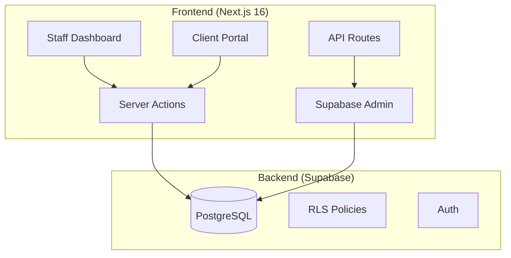

# System Architecture

> Last updated: 2026-01-14

## Overview

Ship Quest is a gamified project management platform with two user types:
- **Staff**: Team members who manage tasks through the Quest Board
- **Clients**: External users who submit and track tickets through the Portal

## Core Architecture

## Authentication Flow

1. **Staff Login**: Email/password via Supabase Auth → Cookie session
2. **Client Login**: Email/password, may use invite tokens
3. **API Access**: API Key header (`x-api-key`) → Hash validation → User context

## Key Design Decisions

### Role-Based Access Control
- Centralized in `src/lib/role-service.ts`
- Roles: `owner`, `admin`, `manager`, `analyst`
- Team-scoped (one user can have different roles in different teams)

### Admin Client Usage
- Service role client in `src/lib/supabase/admin.ts`
- Used when bypassing RLS is required (e.g., cross-table queries, API key validation)
- All API routes use this centralized client

### Server Actions vs API Routes
- **Server Actions**: Used for UI interactions (form submissions, data fetching)
- **API Routes**: Used for external integrations (automation tools, AI agents)

---

## Future: AI Agent Integration

The MCP (Model Context Protocol) server was removed for rebuild. When reimplemented:
- Will use SSE transport for server-to-client communication
- Bearer token authentication
- Proxy to `/api/v1` endpoints

---

## Operational Health & Safety

### System Health Monitoring
- **Endpoint**: `/api/health`
- **Function**: Performs active checks on database connectivity and latency.
- **Usage**: Used by Vercel/external monitors to detect degraded performance or service outages.

### Error Handling & Reliability
- **Global Error Boundary**: Implemented in `@/components/error-boundary.tsx`.
- **Function**: Wraps key UI sections to prevent full-page crashes. Logs caught errors and displays a user-friendly recovery UI.
- **Server Actions**: All actions use a consistent `Result<T>` pattern for structured error reporting.
